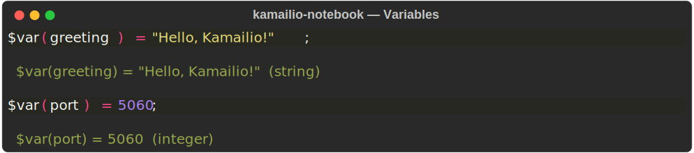
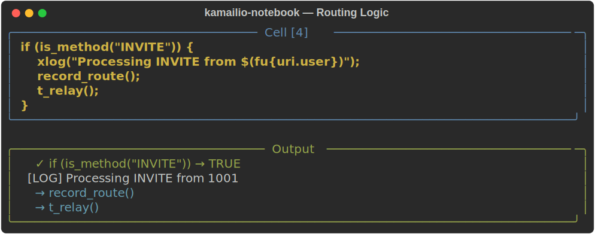
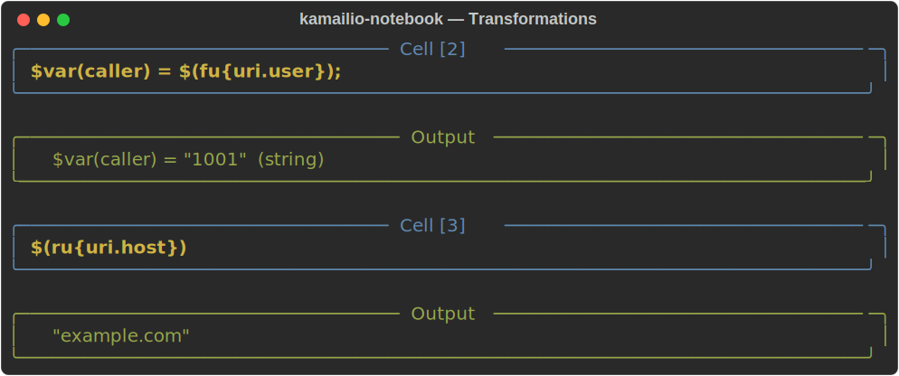
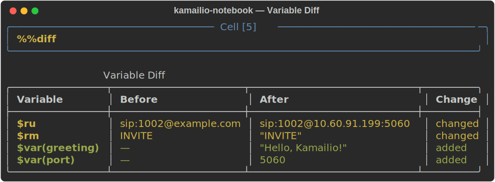

<div align="center">

# kamailio-notebook

**Kamailio SIP Server cfg 스크립팅을 위한 인터랙티브 Jupyter Notebook 커널**

[](https://opensource.org/licenses/MIT)
[](https://www.python.org/downloads/)
[](https://jupyter.org)
[]()

[시작하기](#시작하기) • [데모](#데모) • [기능](#기능) • [커리큘럼](#커리큘럼) • [매직 명령어](#매직-명령어) • [아키텍처](#아키텍처) • [기여하기](#기여하기)

**[English](README.md)** | 한국어

</div>

---

## 문제의식

Kamailio의 기본 `.cfg` 스크립팅 언어는 강력하지만 러닝 커브가 가파릅니다:

- **REPL이 없음** — 표현식을 대화형으로 테스트할 수 없음
- **플레이그라운드가 없음** — 모든 변경이 서버 재시작 + SIPp 테스트 + pcap 분석 필요
- **즉각적인 피드백 불가** — "`$(ru{uri.user})`의 결과가 뭘까?" → 문서 읽고 추측만 가능
- **문서가 부족함** — 함수 동작을 C 소스 코드를 읽어야 이해할 수 있는 경우가 많음

## 해결책

**kamailio-notebook**은 Kamailio cfg에 Jupyter Notebook 경험을 제공합니다:

<p align="center">
  
</p>

cfg 코드를 셀 단위로 작성하고, 결과를 즉시 확인하고, SIP 메시지를 모킹하고, 라우팅 로직을 추적하고, AI 어시스턴트에게 Kamailio에 대해 질문할 수 있습니다 — 모든 것을 한 곳에서.

---

## 데모

### 변수 & 타입



### SIP 메시지 Mock & 라우팅 로직



### 변환 함수



### 변수 Diff



---

## 시작하기

### 사전 요구사항

- Python 3.10 이상
- JupyterLab 4.0 이상

### 설치

```bash
pip install kamailio-notebook
```

### 커널 등록

```bash
kamailio-notebook-install
```

### 실행

```bash
jupyter lab
```

새 노트북에서 **"Kamailio CFG"** 커널을 선택하세요. 끝!

### 소스에서 직접 설치

```bash
git clone https://github.com/pallidev/kamailio-notebook.git
cd kamailio-notebook
python -m venv .venv && source .venv/bin/activate
pip install -e ".[dev]"
kamailio-notebook-install
jupyter lab
```

`notebooks/curriculum/`의 커리큘럼 노트북을 열어보세요.

---

## 기능

### v0.1 — 핵심 실행

| 기능 | 설명 |
|------|------|
| 셀 단위 cfg 실행 | Kamailio cfg 코드를 한 셀씩 작성하고 실행 |
| SIP 메시지 Mock | `%%sip INVITE`로 전체 헤더 파싱이 포함된 가짜 SIP 메시지 생성 |
| 변수 읽기/쓰기 | `$var`, `$avp`, `$ru`, `$fu`, `$rm` 등 15개 이상의 의사변수 |
| `%%kamcmd` 연동 | 노트북 셀에서 실행 중인 Kamailio 인스턴스 직접 조회 |
| Mermaid SIP 플로우 | SIP 메시지 흐름 자동 시각화 |
| Markdown 셀 | Jupyter 기본 Markdown 지원 |

### v0.2 — 변환 함수 & 실행 추적

| 기능 | 설명 |
|------|------|
| 변환 함수 | `{uri.user}`, `{s.len}`, `{s.upper}`, `{nameaddr.uri}` 등 20개 이상 |
| `%%trace` 매직 | 단계별 실행 추적 + 컬러 HTML 출력 |
| If/else 분기 시각화 | 어떤 브랜치를 탔는지 Mermaid flowchart로 표시 |
| Route 블록 추적 | `route[]` 호출 추적 및 실행 경로 기록 |

### v0.3 — 서버 제어 & 상태 추적

| 기능 | 설명 |
|------|------|
| `%%kamailio start\|stop\|status` | 노트북 셀에서 로컬 Kamailio 인스턴스 제어 |
| `%%diff` 매직 | 실행 전/후 변수 상태 비교 (컬러 diff 테이블) |
| 변수 스냅샷 | 변경 추적을 위한 자동 상태 캡처 |

---

## 매직 명령어

| 매직 | 설명 | 예시 |
|------|------|------|
| `%%sip METHOD` | Mock SIP 메시지 생성 | `%%sip INVITE` |
| `%%vars` | 모든 현재 변수 표시 | `%%vars` |
| `%%diff` | 마지막 실행 이후 변수 변경 표시 | `%%diff` |
| `%%trace` | 실행 경로 추적 및 시각화 | `%%trace` |
| `%%kamcmd CMD` | 실행 중인 Kamailio에 kamcmd 실행 | `%%kamcmd dispatcher.list` |
| `%%kamailio CMD` | 로컬 Kamailio 인스턴스 제어 | `%%kamailio status` |
| `%%help TOPIC` | 함수/변수 도움말 표시 | `%%help ds_select_dst` |
| `%%flow` | SIP 메시지 흐름 다이어그램 표시 | `%%flow` |
| `%%reset` | 모든 상태 초기화 | `%%reset` |

---

## 커리큘럼

`notebooks/curriculum/` 디렉토리에 모든 레벨의 구조화된 강의가 있습니다:

### 초급 (SIP & cfg 기초)

| 강의 | 주제 |
|------|------|
| **01 - Hello Kamailio** | 첫 cfg 코드, 변수, xlog |
| **02 - SIP 메시지 & 의사변수** | `%%sip` mock, `$ru`/`$fu`/`$rm`, `$var` vs `$avp` |
| **03 - 라우팅 기초** | `if/else`, `is_method()`, `has_totag()`, `drop/exit` |

### 중급 (실무 패턴)

| 강의 | 주제 |
|------|------|
| **01 - 변환 함수** | `{uri.user}`, `{s.len}`, nameaddr, Base64, 체이닝 |
| **02 - Dispatcher & 라우팅** | `ds_select_dst()`, `%%kamcmd`, INVITE 전체 흐름, REGISTER 처리 |

### 고급 (프로덕션 패턴)

| 강의 | 주제 |
|------|------|
| **01 - Dialog, Failover & 프로덕션** | Dialog 추적, failover, RTPEngine, 플래그, 헤더 조작, `%%trace`, `%%diff` |

---

## 아키텍처

```
┌──────────────────────────────────────────────────────────┐
│                       JupyterLab                         │
│                                                          │
│  ┌────────────────────────┐  ┌─────────────────────────┐ │
│  │   Kamailio CFG Kernel   │  │    Jupyter AI Chat      │ │
│  │                         │  │                         │ │
│  │  [Cell] cfg 코드        │  │  "ds_select_dst가       │ │
│  │        → 결과 출력      │  │   뭘 하는거야?"         │ │
│  │                         │  │                         │ │
│  │  [Cell] %%sip INVITE    │  │  → AI가 노트북 컨텍스트 │ │
│  │        → mock 메시지    │  │    기반으로 설명         │ │
│  └───────────┬─────────────┘  └─────────────────────────┘ │
└──────────────┼────────────────────────────────────────────┘
               │
     ┌─────────┴───────────┐
     │   Hybrid Executor   │
     │                     │
     │  간단한 표현식 ────►│── Python cfg 파서/평가기
     │                     │
     │  복잡한 함수 ──────►│── kamcmd → 실제 Kamailio
     └─────────────────────┘
```

### 프로젝트 구조

```
kamailio-notebook/
├── src/kamailio_notebook/
│   ├── kernel.py            # Jupyter 커널 (ipykernel 기반)
│   ├── cfg_executor.py      # cfg 표현식 파서 & 실행기
│   ├── cfg_tracer.py        # Route 추적 & 분기 시각화
│   ├── sip_message.py       # SIP 메시지 mock 엔진
│   ├── variables.py         # 의사변수 스토어 ($var, $avp 등)
│   ├── transforms.py        # 20개 이상의 변환 함수
│   ├── kamcmd.py            # kamcmd/kamctl 연동
│   ├── kamailio_control.py  # 로컬 Kamailio 시작/중지/diff
│   └── renderer/
│       └── mermaid.py       # Mermaid 다이어그램 생성
├── notebooks/
│   └── curriculum/
│       ├── en/              # 영문 강의 (6개)
│       └── ko/              # 한국어 강의 (6개)
├── tests/                   # 33개 테스트, 전부 통과
├── docs/images/             # 데모 스크린샷 & 영상
├── pyproject.toml
├── LICENSE                  # MIT
├── README.md                # English
└── README.ko.md             # 한국어
```

---

## AI 어시스턴트 학습

이 커널은 [Jupyter AI v3](https://github.com/jupyterlab/jupyter-ai)와 완벽하게 연동되어, [ACP (Agent Client Protocol)](https://jupyter-ai.readthedocs.io/en/v3/getting-started.html)을 통해 JupyterLab 내에서 AI 채팅 패널을 사용할 수 있습니다.

### 설정

```bash
# 1. Jupyter AI 설치
pip install jupyter-ai

# 2. Claude Code CLI 설치 (또는 원하는 에이전트)
#    참고: https://docs.anthropic.com/en/docs/claude-code

# 3. Claude Code ACP 어댑터 설치
npm install -g @agentclientprotocol/claude-agent-acp

# 4. JupyterLab 재시작
jupyter lab
```

### 사용법

1. 런처에서 **Chat** 카드를 클릭하거나, 채팅 사이드바의 **+** 버튼 클릭
2. `@Claude $ru가 뭐야?` 입력 — 에이전트가 노트북 컨텍스트를 보고 답변
3. 에이전트는 파일 읽기/쓰기, 명령어 실행, 노트북 조작 가능

> **팁:** Conda 환경을 사용하는 경우, 먼저 환경 내에 Node.js를 설치하세요:
> `conda install nodejs && npm install -g @agentclientprotocol/claude-agent-acp`

---

## 기존 도구와의 비교

| 기능 | kamailio-notebook | debugger 모듈 | kamcli | kamailio-tests |
|------|:-:|:-:|:-:|:-:|
| 인터랙티브 셀 실행 | ✅ | ❌ | ❌ | ❌ |
| SIP 메시지 mock | ✅ | ❌ | ❌ | ❌ |
| 변수 검사 | ✅ | 일부 | 일부 | ❌ |
| 변환 함수 미리보기 | ✅ | ❌ | ❌ | ❌ |
| 실시간 서버 조회 | ✅ | ✅ | ✅ | ✅ |
| AI 채팅 연동 | ✅ | ❌ | ❌ | ❌ |
| 시각적 실행 추적 | ✅ | cfgtrace | ❌ | ❌ |
| 커리큘럼 노트북 | ✅ | ❌ | ❌ | ❌ |

---

## 개발

```bash
# 클론
git clone https://github.com/pallidev/kamailio-notebook.git
cd kamailio-notebook

# 설정
python -m venv .venv && source .venv/bin/activate
pip install -e ".[dev]"

# 테스트 실행
pytest tests/ -v

# 개발용 커널 설치
kamailio-notebook-install

# JupyterLab 실행
jupyter lab
```

## 기여하기

기여를 환영합니다! 도움이 필요한 영역:

- **더 많은 변환 함수** — 아직 구현되지 않은 Kamailio 변환 함수들이 많습니다
- **모듈별 함수** — `dialog`, `presence`, `permissions` 모듈 함수
- **더 나은 cfg 파서** — 현재 파서는 일반적인 패턴만 처리합니다
- **통합 테스트** — 실제 Kamailio 인스턴스 대상 테스트
- **새 커리큘럼** — 특히 고급 주제 (KEMI, 데이터베이스 연동)
- **번역** — 다른 언어로 된 커리큘럼 노트북

## 라이선스

MIT 라이선스 — [LICENSE](LICENSE) 파일을 참조하세요.

## 감사의 말

- [Kamailio SIP Server](https://www.kamailio.org/) — 이 커널이 서비스하는 프로젝트
- [ipykernel](https://github.com/ipython/ipykernel) — Jupyter 커널 프레임워크
- [Jupyter AI](https://github.com/jupyterlab/jupyter-ai) — JupyterLab AI 채팅 연동

---

<div align="center">

**[버그 신고](https://github.com/pallidev/kamailio-notebook/issues) · [기능 요청](https://github.com/pallidev/kamailio-notebook/issues) · [질문](https://github.com/pallidev/kamailio-notebook/issues)**

[김종인](https://github.com/pallidev)

</div>
